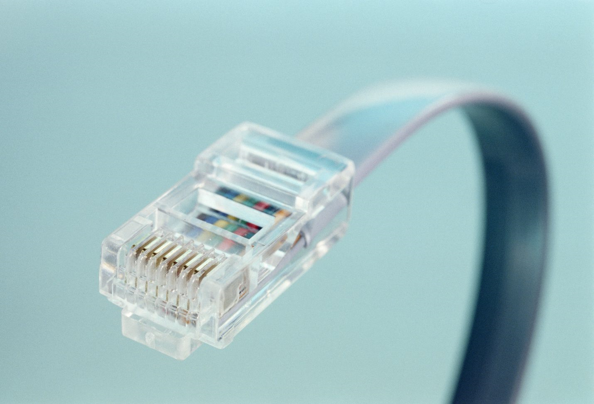
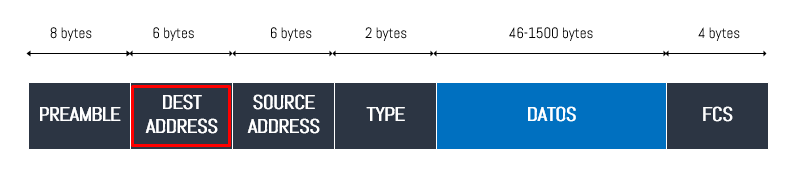
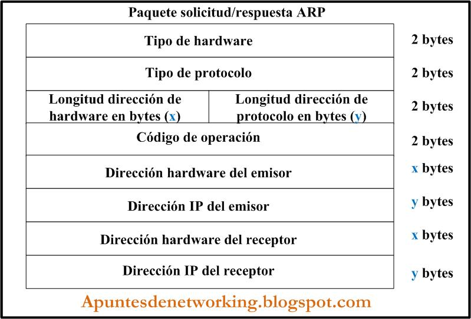

## Protocolo Ethernet y ARP
    En este apartado se hablará sobre los protocolos Ethernet
    y ARP. Se entrará en detalles sobre sus cabeceras y funcionamiento. 
    

>>>>>>>>>>>>>>>Imagen del cable RJ45, icono de este protocolo 

### PROTOCOLO ETHERNET

**Antecedentes:**
> El protocolo Ethernet tiene como precursor al protocolo ALOHA
> siendo Ethernet una mejora basada en muchos de los conceptos de
> este.

> Este protocolo es el más usado para areas locales, cableadas,
> a nivel de enlace. Permite el acceso múltiple y consta de un
> esquema que le permite evitar colisiones.

> Al estar a nivel de enlace se habla de una "trama" cuando nos 
> referimos al paquete enviado. Esta es una traducción directa 
> del mensaje en bits de la capa física y una encapsulación del
> datagrama de la capa de red, que es su superior.

**Estructura del marco Ethernet**
> La trama Ethernet se compone por una carga útil; que es el
> datagrama, ya encapsulado, de la capa superior y por una 
> cabecera Ethernet; que contiene información relativa al 
> direccionamiento, control, uso y comprobación de la 
> comunicación.
>
> Por lo general se estructura en varias subcapas.
>
> El estudio de este protocolo durante la práctica no ha 
> profundizado en cuestiones demasiado concretas. Los aspectos
> que se presentan son en su mayoría básicos. 

>>>>>>>>>>>>>>>Imagen que expresa la trama Ethernet.

Dependiendo del estandar de Ethernet empleado el marco puede variar.
Durante el curso aplicaremos el caso del estandar IEEE 802.3. Algunos 
elementos más generales pueden ser similares entre varios de estos. 
Por ejemplo en *Wireshark* se muestran los iguientes:

- Destino
- Origen 
- tipo (*Frame type*)

Estos datos permiten conocer las direcciones MAC de los dispositivos 
interconectados en la misma red cableada. De esta manera se conoce el
**origen** y el **destino** en una comunicación. Expresados bajo los campos
del marco que indican esto.

Un ejemplo de este caso se produce en las **peticiones GET** a una 
página web. Donde el dispositivo origen solicita una serie de datos 
al dispositivo destino, que es el servidor donde se encuentra alojada.

Eventualmente el servidor contestará con una respuesta, es en este punto
donde se intercambian los roles en cuanto a destinatario y origen. Este
efecto se puede estudiar y visualizar mediante el marco del protocolo
Ethernet.

Esta serie de valores y características son capturados por *Wireshark* 
en formato hexadecimal para expresar la cadena de bits que constituye 
la trama.

>>>>>>>>>>>>>>>Esquema de una comunicación cliente-servidor.

**El campo *frame type*** indica el tipo de frame del paquete que se ha 
capturado o emitido en la comunicación. 

Los valores que este campo puede adoptar son:
- Data Frame.
- Management Frame.
- Control Frame.

En función de la acción que esté resolviendo el protocolo adoptará un tipo u otro.

Sin embargo hay **campos que no podemos capturar** como el **CRC (cyclic redundancy check)**
que está presente en la trama para realizar las comprobaciones pertinentes en cuanto a la 
detección de errores en la comunicación.

Este campo no es visible porque permanece en la 
tarjeta de red en lugar de ser transferido a la aplicación de *Wireshark*.

La popularidad del campo **CRC** recae en su sipleza y gran efectividad en cuanto a detección
y correción de errores. 

> **Funcionamiento:**
> El emisor y el receptor deben estar de acuerdo en un
> patrón de r+1 bits, que se conoce como generador (G).
> El bit más significativo de G debe ser “1”.
>
> Para una determinada secuencia de datos D, el emisor
> añadirá r bits adicionales R, de modo que los r+d bits
> resultantes sean exactamente divisibles por G.*

**En resumen los aspectos generales es el soguiente:**

- Tecnología LAN más utilizada.
- Funciona en la capa de enlace de datos y en la capa física.
- Familia de tecnologías de redes que se define en los estándares IEEE 802.2 y 802.3.
 
 

***

### PROTOCOLO ARP (Address Resolution Protocol) 

    El protocolo ARP suele ser vinculado con la capa de red ya que este ocupa
    la labor de reolución de direcciones. Se encarga de localizar la dirección 
    del hardware relacionado con una dirección IP concreta.

> Esta dirección del hardware se conoce como *Ethernet MAC*.
> Dicha dirección está expresada por un identificador de 48 bits 
> y que es único desde su fabricación.

El protocolo ARP toma la responsabilidad de coordinar las direcciones físicas
y lógicas en la comunicación mediante la red. Este protocolo se ayuda por la
creación de una tabla de direcciones que emplea para la búsqueda.

> Esta tabla se ubica en una memoria caché.
>> La tabla es recurrida por los equipos para comunicarse.
>> De no existir el vínculo es ARP quien arbitra la solicitud.
>> Todos los equipos dentro de la misma red comparan esta dirección
>> fallida con la suya propia y emiten la respuesta al coincidir. 
>> Finalmente el par de direcciones es almacenado.

Se puede **relacionar ARP** con cuatro casos que se dan en la comunicación de dos hosts
- Hay dos *hosts* en una **misma red** y se quieren comunicar
- Dos *hosts* quieren comunicarse a través de un *router* **desde redes diferentes**.
- Cuando un *router* emite un paquete a **través de un router** a un *host*.
- **Dentro de la misma red**, un *router* quiere emitir un paquete a un *host*.

Se **puede caracterizar un paquete ARP** por una serie de campos que emplea para 
atender sus solicitudes de enlace:
- Tipo de hardware (*Hardware address space*)
- Tipo de protocolo (*Protocol address space*) 
- Longitud de ID hardware  (*Hardware address length*)
- Longitud de ID protocolo (*Protocol address length*)
- Operación (*Operation code*) 
- direcciones del hardware (*Source/target hardware address*) 
- direcciones del protocolo (*Source/target protocol address*)
> Las longitudes se dan en bytes.

>Los campos de direcciones de hardware y protocolo se expanden en otros dos.

>>>>>>>>>>>>>>> Se muestra un diagrama de la estructura de un paquete ARP

Cada uno de los campos son empleados para la correcta conexión entre dos puntos
> Los primeros 4 bytes son ocupados por los tipos de hardware y protocolo. Estos
> son usados a fin de identificar el hardware y protocolo adecuados para establecer
> la comunicación.

> Los siguientes 2 bytes son compartidos para representar la longitud de las direcciones 
> tanto hardware como de protocolo en términos de bytes y refiriendose al datagrama.
>
> Por ejemplo para el protocolo IP expresaría 4.

> Los consecutivos 2 bytes al ultimo campo son utilizados para introducir el código
> de operación. Es en este apartado donde se indica que el datagrama es una solicitud
> o una respuesta. 
>
> En el caso de ser un 1 se habla de una operación de petición y de ser un 2 una respuesta
> sin embargho en la página [Network Sorcery](http://www.networksorcery.com/enp/protocol/arp.htm) se habla más en profundidad de sus valores.

> A partir del último campo lo que se incluye son, primero, las direcciones hardware e 
> IP del emisor. A este le siguen los mismos campos pero para el receptor.
>
> Nótese que la longitud variará en función de las longitudes registradas para cada parte 
> de las direcciones.