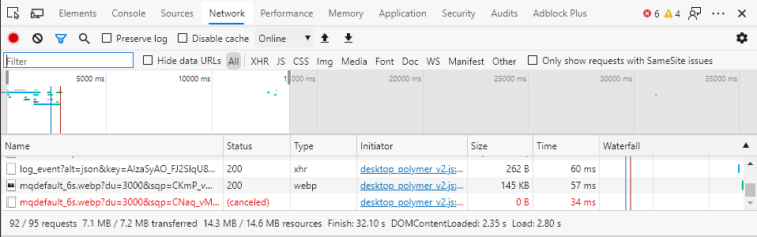

## Protocolo HTTP
    Es en esta parte del documento es donde se expondrán varias de las 
    características del protocolo HTTP y su análisis.   

>>>>>>>>>>>>>> Imagen de cabecera del protocolo HTTP, suele aparecer antes de la dirección DNS para indicar que se emplea ese protocolo.

 
 

    HTTP hace referencia a las siglas en inglés de Hyper Text
    Transfer Protocol. Es un protocolo a nivel de aplicación. Transmite 
    sobre el protocolo TCP y es empleado para la comunicación cliente-servidor 
    donde se transfiere la información que requiere el navegador para mostrar 
    una página por pantalla. 

> Aunque el ejemplo más sencillo sea el navegador también sirve a otro tipo de 
> aplicaciones y programas.

    Por lo general se emiten dos grupos de datos. El propio 
    contenido (que no es necesariamente hypertexto) y los 
    metadatos contenidos en la cabecera.
    
> Lo primero que se nos viene a la cabeza con este protocolo es
> la petición de doucmentos HTML. 

> Fue diseñado a principìos de los 90 y se caracteriza por ser 
> en gran medida ampliable.

El protocolo HTTP opera usando una serie de mensajes formateados que depende de unas 
estructuras definidas.

En lugar de ser un flujo continuo de datos, en este caso, se emplean comunicaciones mediante 
**petición** y **respuesta**. 

Una petición hace referencia al mensaje que envía el cliente
mientras que los que son emitidos por el servidor se conocen como respuestas.
 
Los tipos de operaciones HTTP más comunes son:

- GET: es una solicitud de datos al servidor.
    > Indica que solicitamos un recurso como HTML, CSS o cualquier otro tipo de archivo.

- POST: es una solicitud para enviar una entidad a un recurso en específico.
    > Se emplea comunmente en los formularios. Causa cambios en el estado.

- PUT: reemplaza las representaciones del recurso con la carga útil.

- DELETE: Borra el recurso especificado.

> También se les conoce como peticiones HTTP, mensajes HTTP o métodos HTTP.

> Se encuentra una lista más extensa  y detallada en la [página de Mozilla](https://developer.mozilla.org/es/docs/Web/HTTP/Methods)

**Las peticiones** tienen una estructura de mensaje distinta a la de las respuestas. Se componen 
por el tipo de petición, el path o ruta a la que se aplica, la versión del protocolo y luego 
la serie de cabeceras que componen los metadatos del mensaje. Esta última sección se reemplaza
por el cuerpo del mensaje cuando la petición lo requiere (POST, PUT, etc.)

*Tal y como se observa en la imagen siquiente:*

>>>>>>>>>>>>>>> Esquema descriptivo de una petición HTTP

 
 

Por otro lado **las respuestas** HTTP son compuestas por la versión del protocolo, el código 
de estado, que es seguido por el mensaje de estado y los headers. Opcionalmente se añade el 
recurso que se ha perdido.

Los códigos de estado se resumen en:
- 1xx (Respuesta)
- 2xx (Éxito)
- 3xx (Redirección) 
- 4xx (Error del cliente) (como el 404 -> página no encontrada)
- 5xx (Error del servidor) (como el 503 -> servicio no disponible)

    > todos estos códigos se especifican más aún en sus distintas variantes (101, 102, ...)

*Se puede apreciar mejor la estructura de la respuesta en la siguiente imagen:*

>>>>>>>>>>>>>>> Esquema descriptivo de una respuesta HTTP

 

Todos estos aspectos pueden ser apreciados y analizados desde *Wireshark* a modo de paquetes.
Sin embargo en el propio **navegador** también se puede hacer un **análisis de red** de la
comunicación cliente-servidor mediante el protocolo HTTP. 

 
***
 

Si hacemos hincapié en el proceso de la comunicación estudiado en la práctica, se puede apreciar que la primera petición realizada es de DNS.

Esto se da debido a que primero debemos solicitar un acceso al servidor DNS que proporciona
una traducción del dominio solicitado.

La traza es la siguiente: 

    
PC :arrow_right:PETICIÓN AL DOMINIO:arrow_right:PETICIÓN AL SERVIDOR DNS:arrow_right:RESPUESTA CON IP TRADUCIDA:arrow_right:ACCESO.

 
Cabe destacar que el navegador suele proporcionar una información bastante detallada.
Durante la práctica se ha observado, sobre todo, en el análisis de los header de las
peticiones que proporcionan información relevante a la versión HTTP empleada por el 
navegador o el lenguaje que usa, del mismo modo que también ilustra la dirección IP origen
y la destino o el lenguaje que usa el sitio. 

También la información puede indicar datos relativos a las peticiones ejecutadas así como su fecha de modificación o ejecución. Inclusive se puede ahondar en el estado recibido.

Muchas veces, también se puede apreciar como las peticiones son requeridas pero omitidas, más
aún en el acceso a sitios web recientes. Esto se puede deber a que los archivos, HTML entre 
otros, ya han sido guardados en una caché. Esto se emplea para facilitar y agilizar la carga de datos.

*Toda esta información se suele observar en esta herramienta del buscador:*

>>>>>>>>>>>>>>> Imagen del apartado de análisis de red del navegador