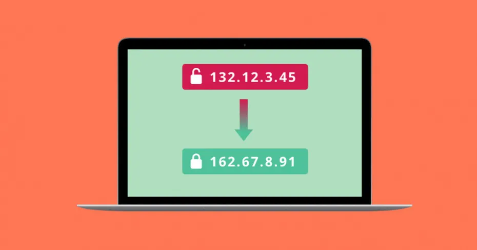
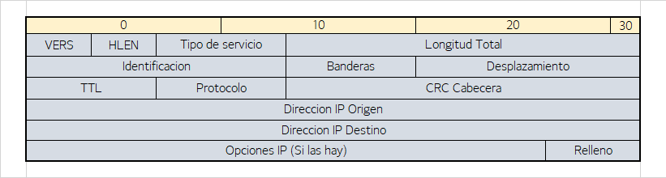
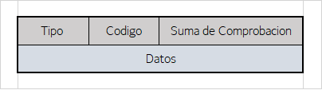
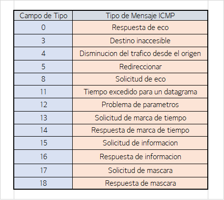

## Protocolo IP e ICMP
      En este apartado se hablará sobre los protocolos IP e ICMP. 
      Se hablará sobre la estructura de paquetes IP  y sus campos de cabecera, asi como la fragmentacion IPv4, utilidad y necesidad de ICMP, comandos *ping* *traceroute*.
      Ambos protocolos se encuentran en la capa de red.

>>>>>>>>>>>>>>>Portada del Protocolo IP

### Protocolo IP (Internet Protocol)

**Introduccion**

 El protocolo IP es la base fundamental de Internet, se encarga de mover datagramas a traves de un conjunto de redes interconectadas.
 Como mencionamos antes, se encuentra en la capa de red, aunque en esta hay mas componentes que hacen posible la funcionalidad de la capa de red:
> - Protocolo de enrutamiento.
> - Protocolo ICMP.

**Estructura**

Cada datagrama IP contiene:
> - Cabecera.
> - Datos a transmitir.

**Funciones**

> - Mover datagramas entre un conjunto de redes interconectadas, pasándolos de un módulo a otro hasta el destino.
> - Los módulos residen en hosts y pasarelas en internet.
> - Se encaminan a través de redes individuales mediante la interpretación de una dirección internet.
> - En el enrutamiento entre módulos los datagramas pueden necesitar atravesar una red de menor tamaño.
> - La cabecera contiene toda la información necesaria para que hosts y routers puedan encaminarlos a sus destinos y fragmentarlos cuando sea necesario.
> - Fragmentacion: Mecanismo para aligerar los paquetes que superen el tamaño maximo permitido, se parte el paquete en trozos mas pequeños

**Cabecera**

>>>>>>>>>>>>>>>Cabecera de un datagrama del protocolo

La cabecera tiene 20 bytes de longitud, es decir, 5 palabras, donde se encuentran diferentes campos, como:

> * VERS: Indica la version del protocolo (IPv4 o IPv6)
> * HLEN: Longitud de la cabecera
> * Tipo de Servicio: Es el servicio solicitado por el datagrama IP
> * Longitud Total: Longitud total del datagrama (Datos y Cabecera)
> * Identificacion: Indica a que datagrama pertenece el fragmento para ayudar a reunir los fragmentos del datagrama anteriormente fragmentado
> * Banderas o flags: Sirven para el control de la fragmentacion
> * Desplazamiento de Fragmento: Se usa en datagramas fragmentados para ayudar al reensamblado del datagrama completo
> * TTL: Es un valor incluido para que los datagramas no esten en bucles de enrutamiento infinitos. Su valor decrementa en 1 cada vez que pasa > por el router, si llega a 0, la trama se descarta.
> * Protocolo: Indica el numero del protocolo de alto nivel al que IP deberia entregar los datos del datagrama
> * CRC: Es el checksum de cabecera
> * Direccion IP origen: Contiene la direccion del emisor
> * Direccion IP destino: Contiene la direccion de destino
> * Opciones IP: Su longitud varia dependiendo de la funcion de la opccion que tenga

**Fragmentacion**

Es una solución al problema que se nos presenta cuando queremos enviar un
paquete de datos de un tamaño superior al que puede enviar el protocolo de la capa
de enlace. Para solucionar esto, se fragmentan los datos del datagrama en varios datagramas más
pequeños, cada uno de estos datagramas más pequeños se llaman fragmentos.

Si fragmentamos el paquete, habrá que ensamblarlo en algún momento. Esto se suele hacer en el dispositivo recceptor (para no sobrecargar a los routers y no complicar el protocolo).
Para lograr este ensamblado, se usan los campos de la cabecera, que nos indican a
qué paquete pertenecen los fragmentos, si el fragmento es el último o no y en qué
posición del datagrama va el fragmento. De esta forma es factible hacer la
fragmentación y el ensamblado de forma correcta y precisa.

 
 

***

### PROTOCOLO ICMP (Internet Control Message Protocol)

**Introduccion**

El protocolo ICMP es otro de los componentes de la capa de red. La funcionalidad de este protocolo es el intercambio de informacion acerca de la capa de red, generalmente mensajes de error.

Usa el soporte basico de IP como un protocolo de nivel superior (Es realmente una parte de IP). Concretamente, ICMP, se situa por encima de IP, el motivo de esto es que todos los mensajes ICMP son transportados dentro de datagramas IP. Es decir, el mensaje ICMP es la carga util del datagrama.

Las cabeceras de estos mensajes son bastante sencillos, solamente tienen 3 campos:

>>>>>>>>>>>>>>>Cabecera de un mensaje ICMP

> * Tipo: En este campo esta situado el tipo de mensaje, como el tipo de error que ha ocurrido o que solucitud se ha hecho.
> * Codigo: Subtipo del primer campo Tipo, precisa el motivo.
> * Suma de Comprobacion: Datos de comprobacion de errores

>>>>>>>>>>>>>>>Campo Tipo y significados

**Comandos Ping y Traceroute**

> *    Comando Ping 

       - Utiliza el protocolo ICMP para envía una petición de eco a un host o router.
       - Al emitir echo request se recibe un echo response, estos datagramas se componen por:
             · Cabecera IP + Cabecera ICMP + carga util: estampa de tiempo y numero de bytes de relleno
       - Con el mecanismo se pretende averiguar si el nodo destino es alcanzable, y saber su tiempo de ida y vuelta.
                    
> *    Comando Traceroute: 

       - Determinar el recorrido entre dos hosts, usa el campo TTL de la cabecera IP
       - Un paquete podría quedar vagando infinitamente por la red, por lo tanto debe existir un mecanismo que detecte esto.
       - El campo TTL asigna un valor por defecto (64) en el emisor, dicho valor decrementa al cruzar un router.
       - Si el valor llega a 0 el paquete es descartado y se envía un mensaje ICMP (TTL exceeded) al emisor.
       - Traceroute construye un paquete para emitirlo entre dos hosts, TTL toma el valor 1 en este caso.
       - Vuelve al emisor tras devolverlo el primer router, luego se emite con  TTL valor 2 (causando otro mensaje ICMP)
       - El proceso sigue hasta alcanzar el destino, al llegar toma la carga util y la interpreta:
       
            · Carga útil como mensaje ICMP "Echo request", se responde con Echo reply.
            · Carga útil como datagrama UDP a un puerto aleatorio, se responde con Destination unreachable (ICMP)
            · Carga útil como segmento TCP a un puerto aleatorio incluyendo un flag de sincronización activo -> Destination unreachable (ICMP) 

        - Cuando el host emisor recibe el mensaje se termina la traza y se finaliza el proceso
