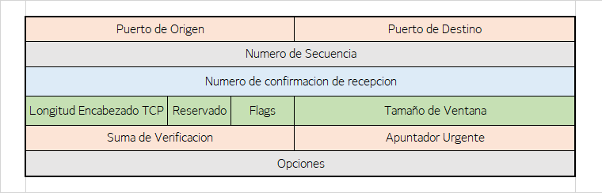

## Protocolo UDP y TCP
    En este apartado se hablara sobre los protocolos UDP y TCP.
    Se hablará sobre la estructura y funciones generales de UDP y TCP.
    Tambien se comentará el cierre TCP y el funcionamiento ACK en TCP.

>>>>>>>>>>>>>>>Portada para ambos protocolos

### Protocolo UDP (User Datagram Protocol)

**Introduccion**

El protocolo UDP es un protocolo de la capa de transporte, por lo que trabaja con segmentos.
Este protocolo se limita a proporcionar las cosas minimas que la capa de transporte debe realizar. Su
principal funcionalidad es pasar los mensajes de la capa de transporte a la de red, y los datagramas de
la capa de red a la de transporte.

Propiedades de UDP:
> * Incluye deteccion de errores
> * Si se utiliza UDP, la aplicacion se comunica casi directamente con el protocolo IP

**Caracteristicas de UDP**

> * Mejor control en el nivel de aplicación: Esta se refiere al envío y cuando
se realiza este. Cuando un proceso de la capa de aplicación le pasa los
datos, los empaqueta (en un segmento UDP) e inmediatamente entrega
dicho segmento a la capa de red, debido a que no posee un mecanismo de
control que regule el flujo (como pasa con TCP). Esto afecta a las 
velocidades de transmisión.

> * Sin establecimiento de la conexión: A diferencia de TCP, que debe realizar
un proceso de la conexión antes de realizar la transferencia de datos, UDP
no añade ningún retardo debido al establecimiento de conexión.

> * Sin información del estado de la conexión: UDP no tiene control sobre la
información del estado de la conexión y no controla ninguno de estos
parámetros.

> * Poca sobrecarga debida a la cabecera de los paquetes: Los segmentos
UDP solo requieren 8 bytes en la cabecera, mientras los TCP, requieren 20
bytes.

**Cabecera**

Tiene un total de 4 campos de 2 bytes cada uno, por lo que ocupa un total de 8 bytes

>>>>>>>>>>>>>>>Cabecera de un mensaje UDP

> * Puerto de origen: Indica el puerto del proceso que envía, es el puerto que
se direcciona en las respuestas.
> * Puerto de destino: Especifica el puerto del proceso destino en el host de
destino.
> * Longitud: Es el tamaño, en bytes, de este datagrama de usuario incluyendo
la cabecera.
> * Checksum: Es un campo opcional, de 16 bits, que permite realizar la suma
de comprobación.

 
 

### Protocolo TCP (Transmission Control Protocol)

**Introduccion**

El protocolo TCP es uno de los protocolos más usados en Internet. Forma parte de la
capa de transporte. Los principales servicios que ofrece son de comunicación
segura, orientado conexión, full-duplex, punto a punto y, evidentemente, multiplexación/demultiplexación.

La conexión que se establece se denomina “acuerdo en tres fases”. Esto es porque
para establecerla, hay que enviar un total de 3 paquetes. 

Los dos primeros segmentos enviados no llevan ninguna carga útil. En este inicio de conexión tambień se acuerdan parámetros de la comunicación como los buffers de emisión.

Cabe resaltar que esta conexión es conocida únicamente por los nodos extremos de
la comunicación. Los nodos intermedios (routers y switches) no saben de su
existencia. Por el simple hecho de que estos dispositivos solo ven datagramas, no conexiones.

Cada segmento tiene una cabecera de formato variable debido al campo
de opciones. Sin opciones, la cabecera ocupa un total de 20 bytes. Como se aprecia
en la siguiente imagen, tiene los siguientes campos:

>>>>>>>>>>>>>>>Cabecera de un mensaje UDP

> * Puerto origen: Identifica el número de puerto de un programa de aplicación
de origen.
> * Puerto destino: Identifica el número de puerto de un programa de aplicación
de destino.
> * Número de secuencia: Especifica el número de secuencia del primer byte
de datos de este segmento.
> * Número de confirmación de recepción: Contiene el valor del siguiente
número de secuencia que el emisor del segmento espera recibir.
> * Longitud encabezado TCP: Especifica el tamaño de la cabecera en
palabras de 32 bits.
> * Reservado: Se deja para uso futuro, debe estar a 0.
> * Flags: Se emplean para diferentes variables como SYN,FIN,RSt,ACK...
> * Tamaño de ventana: Tamaño de la ventana de recepción que especifica el
número máximo de bytes que pueden ser introducidos en el buffer.
> * Suma de verificación: Utilizado para la comprobación de errores tanto en
cabecera como en datos.
> * Puntero urgente: Cantidad de bytes desde el número de secuencia que
indican el lugar donde acaban los datos urgentes.
> * Opciones: Se utiliza para poder añadir características no cubiertas en la
cabecera.

Para poder proporcionar una transferencia de datos fiables, TCP usa los campos “Número de secuencia” y “Número de confirmación de recepción”.
> * La forma en que esto funciona es la siguiente:

Cuando el protocolo TCP inicia la conexión, este observara el flujo de datos de
comunicación como un conjunto de bytes desordenador. Por lo que no va a ver la comunicación como un envío de paquetes sino como un envío de bytes. 

 * Por tanto, cada paquete va a tener en el campo “Número de secuencia” el número del primer byte del segmento dentro de todo el flujo de bytes de la comunicación. 

> * Esto facilita la identificacion de los diferentes paquetes.

 * El otro elemento es el que se coloca en el campo “Número de confirmación de recepción”.

> * Este número indica el número de secuencia del siguiente byte que está esperando el
transmisor. Es decir, mediante el siguiente byte que espera se dice hasta dónde ha recibido
el receptor la secuencia de bytes.

> * La confirmación de recepción de paquetes se hace entonces mediante el campo “Número de confirmación de recepción” y el flag ACK.

> *  No podemos hablar de mensajes ACK como tal porque al ser una conexión full-duplex el ACK de los mensajes recibidos se transmite conjuntamente con un nuevo paquete de información, haciendo más eficiente el protocolo.

> * Se puede dar la situación de que nos encontremos con un hueco. Es decir, haber
recibido el mensaje n antes que el n-1. Esto nos causa un problema que no se especifica en la
definición del protocolo. El receptor indicará hasta dónde tiene y el emisor tendrá que enviar
la secuencia correspondiente, pero si el receptor tiene una secuencia posterior puede
descartarla y esperar a que le llegue de una manera ordenarla o guardarla a la espera de
que lleguen los bytes faltantes.

> * Para el reenvío de paquetes perdidos TCP usa un temporizador, con un tiempo estimado de
ida y vuelta del paquete para saber si se ha perdido. En caso afirmativo el paquete es
reenviado.

**Ejemplo de comunicación TCP**

>>>>>>>>>>>>>>>Ejemplo de comunicacion TCP

En este ejemplo vemos cómo se envía un mensaje con inicio de secuencia en x. El otro punto de la
conexión (server en este caso) envía un nuevo paquete con una secuencia que inicia en y,
añadiendo la confirmación (ACK) del mensaje anterior, indicando que espera recibir el byte siguiente (indicado como x+1).

